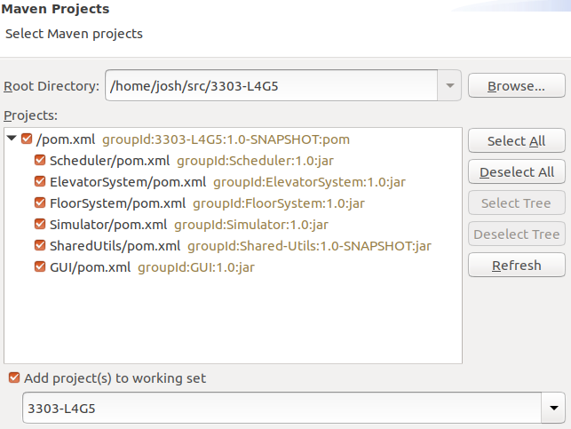

# Elevator Simulation

## Branch Naming Policy
Name the branch "iteration#-the feature you are working on"  
After code review, it can be pushed to the branch "iteration#"

## Authors
- Joshua Fryer
- Tanvir Hossain
- Mattias Lightstone
- Yu Yamanaka
- Xinrui Zhang

# Dependencies
This system requires JavaFX to be installed. Additionally, it requires a working,
stable internet connection since some communications are handled with a
cloud-hosted [RabbitMQ](https://www.rabbitmq.com/) server. It can be run locally,
but this requires that a RabbitMQ server be running on your machine. This is not
recommended and is not compatible with the requirements outlined for this project,
and as such setting it up is not covered in this document.

# Running with Maven (Deprecated after addition of GUI)
This project can be run by navigating to the directory where the project is extracted and executing
`./start.sh` in the Linux terminal, or `start.bat` in the Windows command prompt.
If you do not have Maven installed, follow the directions [here](https://maven.apache.org/guides/getting-started/windows-prerequisites.html).

# Running from Eclipse (Needed to properly run GUI)
Follow the instructions [here](https://www.tutorialspoint.com/maven/maven_eclispe_ide.htm) to 
import and run the project. Eclipse has native Maven support, so this should work.
Your Import window, before you click Finish, should look like this:

### Running with dynamic configuration
By default, all modules will refer to a configuration file located at
SharedUtils/src/main/resources/config.properties. This file contains system
constants such as networking information (static IP addresses and ports for
subsystems, as well as the number of floors and number of elevators to be used.

If the modules are run with the `config` command line option, then the the GUI
console will prompt the user to enter the desired number of elevators and floors.
This is an all-or-nothing choice however; if any subsystems are run without this
option, they will load properties from the static file, causing their parameters
to be out of sync with the dynamically-configured subsystems.

# Subsystems
This Elevator System Consists of five subsystems:

## Floor System
FloorSystem is responsible for simulating passenger actions on the floors of
a building, and the operation of lamps. It contains an array of Floor objects,
each representing an individual floor. It takes button inputs from each floor
(implemented in Iteration 1 as messages from the Simulator) and sends messages
to the Scheduler using a class called MessageHandler.
It also controls the lamps on each floor, which indicate the direction in which
elevators are moving, and which turn off when an elevator arrives. 

## Scheduler System
The Scheduler system acts as an intermediary between the Floor and Elevator
systems, taking input from both systems and coordinating the elevator.
Messages from the Floor system represent passengers requesting an elevator from
a given floor.
Messages from the Elevator system represent either passengers pressing a
button from within the elevator to request a destination, or a notification
that the elevator has arrived at a floor. This notification occurs upon
arrival at _any_ floor, and its purpose is to update the scheduler's
representation of the system's state.

## Elevator System
The Elevator system represents the physical elevator. It receives a message
from the Scheduler, which instructs it what floor to travel to, and will
move towards that floor until it reaches its destination, or is interrupted by
a new instruction from the Scheduler.

## Simulator System
The Simulator system reads from the provided input file and sends messages
using the read data to simulate button presses within the Floor and Elevator
systems. 

## GUI
The GUI system displays the current status of all the elevators in the system;
it shows which floor they are on, whether their doors are open or closed, and
whether they have encountered a fault. 
It also allows the user to interact with the system, providing buttons to click
on each floor, to simulate a passenger using them to request an elevator. It
also displays a popup window when an elevator arrives at a destination floor, 
allowing the user to simulate a passenger pressing a button on the inside of the
elevator car.

# Directory Structure
- Documentation such as diagrams are located in /doc.
- Each module's source code is located in <packagename>/src/main.java.
From there, the subdirectories follow a structure commonly used in Java programs,
and particularly Android applications, wherein the directories spell out a 
reversed domain name (in this case, com.sysc3303). Within this domain package
are the .java source files for that module.
- Additionaly, the Shared-Utils directory contains sources for classes that
are used by multiple modules, such as most of the communications code.

